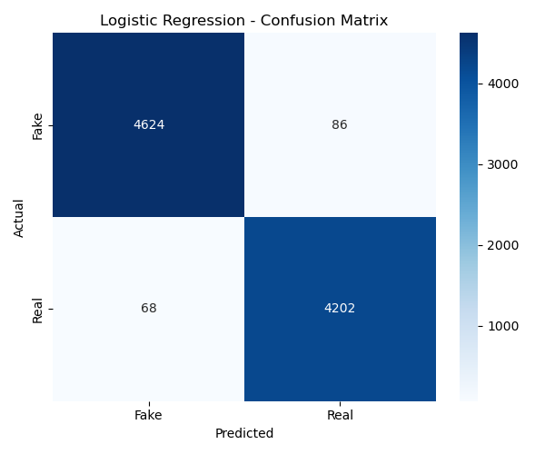

# Fake News Detector using Machine Learning & NLP

This project classifies news articles as **real** or **fake** using a full machine learning pipeline with **NLP preprocessing**, **TF-IDF vectorization**, and two classification models: **Naive Bayes**, **Logistic Regression** and **LSMT (Deep Learning)**.

Built as a final ML project using the [Fake and Real News Dataset](https://www.kaggle.com/datasets/clmentbisaillon/fake-and-real-news-dataset).

---

## Project Structure

```
fake-news-detector/
├── data/             # Dataset CSVs
├── models/           # Saved .pkl model files
├── outputs/          # Confusion matrices & WordClouds
├── notebooks/        # Jupyter notebook version
├── src/              # Modular code files (preprocess, train, eval, etc.)
├── main.py           # Runs the full ML pipeline
├── requirements.txt  # Dependencies
└── README.md         # Project overview
```

---

## What the Project Does

- Preprocesses raw news article text
- Converts text to numeric features with TF-IDF
- Trains and evaluates two ML models
- Saves trained models + evaluation visuals
- Generates WordClouds to compare language in real vs fake news

---

## Models Used

| Model                        | Accuracy | Precision | Recall | F1 Score |
|------------------------------|----------|-----------|--------|----------|
| **LSTM (Deep Learning)**     | 98.57%   | 97.81%    | 99.23% | 98.51%   |
| **Logistic Regression**      | 98.29%   | 97.99%    | 98.40% | 98.20%   |
| **Naive Bayes**              | 93.54%   | 93.23%    | 93.18% | 93.21%   |


###  Breakdown & Observations

#### LSTM (Deep Learning)
- **Best performing model overall** in both recall and F1 score.
- Especially strong at minimizing false negatives — great for **not missing** fake news.
- Slightly more complex to train and deploy, but yields high returns.

#### Logistic Regression
- Very competitive and almost on par with LSTM.
- Simple, interpretable, and fast to train — an excellent baseline for NLP tasks.
- Balanced performance makes it highly reliable for production use.

#### Naive Bayes
- Performs reasonably well, but clearly lower than the other two.
- Extremely fast and lightweight — suitable for quick prototyping.
- Better as a benchmark model rather than final deployment.
---

## Sample Visuals

### Confusion Matrix (Logistic Regression)


### WordClouds  
Fake News | Real News  
:-------------------------:|:-------------------------:  
 | 

---

## ML & NLP Concepts Covered

- Supervised Learning (Binary Classification)
- Text Cleaning & Preprocessing
- TF-IDF Vectorization
- LSTM with Embedding & Tokenizer
- Naive Bayes & Logistic Regression
- Model Evaluation (Precision, Recall, F1 Score)
- Data Visualization (WordClouds, Confusion Matrix)

---

## How to Run the Project

### Install dependencies
```bash
pip install -r requirements.txt
```

### Download dataset
Download from [Kaggle](https://www.kaggle.com/datasets/clmentbisaillon/fake-and-real-news-dataset)  
Place `Fake.csv` and `True.csv` into the `data/` folder.

### Run full pipeline
```bash
python main.py
```

### Or run notebook interactively
```bash
notebooks/Fake_News_Detection.ipynb
```

---

## Future Work

- Deploy via Streamlit or Flask
- Extend to multiclass classification (e.g. topic labeling)

---

## License

MIT License. Free to use and modify with credit.

---

Built by Aashish Panthi and Prashan Sapkota as part of a Machine Learning final project.
